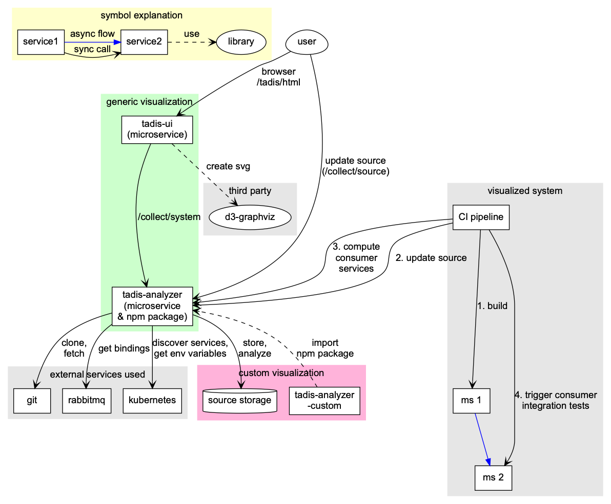

# Target Architecture

- each microservice holds its own copy of the graph model

## visualizer-d3

- current generic web frontend
- based on TypeScript, Graphviz and D3
- supports default types for nodes and edges in microservice systems, e.g. a message exchange node and an async data flow edge with a routing key property

## visualizer-react

- future generic web frontend
- based on TypeScript, Graphviz and React

## generic analyzer

- based on TypeScript and Nest
- gets all services from a service discovery api
- gets env variables from kubernetes pods
  - configurable transformer from env variables to graph fraction
- clones/fetches/updates sources via git and external storage
- scrapes a fraction of the graph from certain microservice which are running an agent
- provides its Nest modules as a NPM library

## custom analyzer

- fully customizable analyzer with additional source code analysis algorithms
- replaces the generic analyzer
