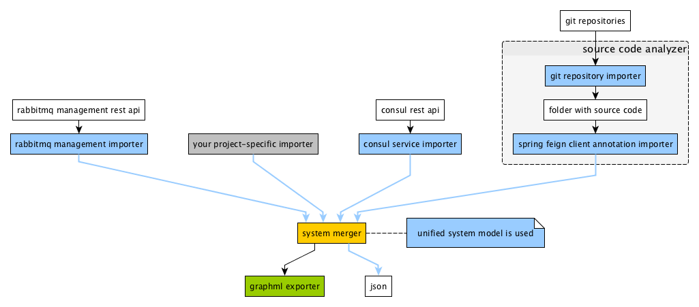

## WARNING: This package is no longer maintained. It is the first version of the analyzer which is based on Consul and has no Kubernetes support. This analyzer is replaced by [tadis-analyzer](../tadis-analyzer).

---

# microservice-system-analyzer

[](https://standardjs.com)

This software determines the communication links in a system of microservices in order to visualize the topology of the system. The approach is based on analyzing static resources, e.g. REST APIs of infrastucture services and the source code of the microservices. For each source of information, a dedicated importer is responsible. Finally, all information is merged into a complete picture of the system. The approach is more lightweight as it does analyze dynamic communication. This is in contrast to APM solutions suchs as AppDynamics.

The analyzer collects information by

  1. accessing infrastructure services via REST APIs (e.g. Consul and RabbitMQ) and by
  2. parsing the source code of microservices.

## Example

[This is an example topology](./example-graph.png) created from analyzing a real system. It was created by using the layouting tool [yEd](https://www.yworks.com/yed) on the GraphML export (see GraphML exporter below).

## Current Status

The project was initially developed in Node.js 8 and with a [system model](src/model/modelClasses.d.ts) (referred to as v0 model) that turned out to be not flexible enough. At the moment, the code is being transitioned to TypeScript in small steps and the model is replaced by a more flexible [v1 system model](src/model/model.ts). The old v0 system model API that is described in the following sections will remain available until version 1.0 is released.

## Architecture

Each importer collects information that provides a view of the system. This information is merged into a complete structure of the system. Exporters can transform the system to different formats. In each component, a unified system model is used to simplify integration.



### Importers

#### Spring Boot FeignClients

An importer that searches for `@FeignClient` annotations in source code to capture synchronous communication links.

#### RabbitMQ Management

An importer for asynchronous communication links that accesses the RabbitMQ Management API. It requires to follow a schema for naming queues and exchanges.
- Schema:
  - A sending microservice `s` must send data to an exchange `s`, i.e. the exchange must have the same name as the sending microservice.
  - A receiving microservice `r` must create a queue.
    - The queue must be bound to the exchange `s`.
    - The queue name must match the following regular expression: `r\.\w*`.
- Example:
  - Given two Microservices A and B where B receives events from A.
  - Microservice B has a queue named `B.foo` which is bound to the exchange A.
  - Microservice A sends data to the exchange A.

#### Further importers

- Consul
- Git-Repositories

### Exporters

- JSON
- GraphML

## Requirements

- Node.js 8
- Git CLI

## Getting started

### Tests

Tests can be run via `npm run test`.

### Configuration

The library is configured by the following environment variables:

  - CONSUL_PATH: URL to Consul HTTP API
  - RABBITMQ_PATH: URL to RabbitMQ Management HTTP API
  - GIT_REPOSITORY_PREFIX: Prefix for Git Repositories, e.g. `git@gitlab.yourOrganisation.de:group/`
  - IGNORED_SERVICES: comma separated list of services or part of service names to ignore in analysis
  - SOURCE_FOLDER: location of source files in the local file system which are imported with the Git importer

### Example usage of importers and merger

The library offers importers, exporters and a merger that have to be combined. The following code shows an example usage for merging the resulting systems of several importers.

```javascript
const analyzer = require('microservice-system-analyzer')

const consulImporter = analyzer.importer.consulImporter
const feignImporter = analyzer.importer.feignClientImporter
const rabbitmqImporter = analyzer.importer.rabbitmqManagementImporter

const systemMerger = analyzer.processor.systemMerger
const subSystemTransformer = analyzer.processor.subSystemTransformer

async function getSystem () {
  const consulSystem = await consulImporter.getSystem()
  const rabbitmqSystem = await rabbitmqImporter.getSystem()
  const feignSystem = await feignImporter.getSystemWithLinksInReverse()
  const mergedSystem = systemMerger.mergeSystems([consulSystem, rabbitmqSystem, feignSystem])

  return mergedSystem
}

async function getSystemWithSubSystems () {
  const flatSystem = await getSystem()
  const structuredSystem = subSystemTransformer.transform(flatSystem)

  return structuredSystem
}
```

### Example usage of Git importer

Some importers require source code that is usually available via Git repositories. The following example shows how to use the Git importer to get the source code.

```javascript
const analyzer = require('microservice-system-analyzer')

const gitImporter = analyzer.importer.gitRepositoryImporter
const configRepository = analyzer.configRepository

const sourcePath = gitImporter.importRepository(serviceName, getRepositoryName(serviceName))
// import is successfull if sourcePath is not null

function getRepositoryName (serviceName) {
  return configRepository.getGitRepositoryPrefix() + serviceName
}
```

### Example usage of GraphML exporter

The code below shows how to use the GraphML exporter on a system returned by a merger or an importer.

```javascript
const analyzer = require('microservice-system-analyzer')

const graphMLExporter = analyzer.exporter.graphMLExporter

const xml = graphMLExporter.getGraphML(system)
```

## License

[Apache License, Version 2.0](LICENSE)

Copyright 2017-2018 Andreas Blunk, MaibornWolff GmbH