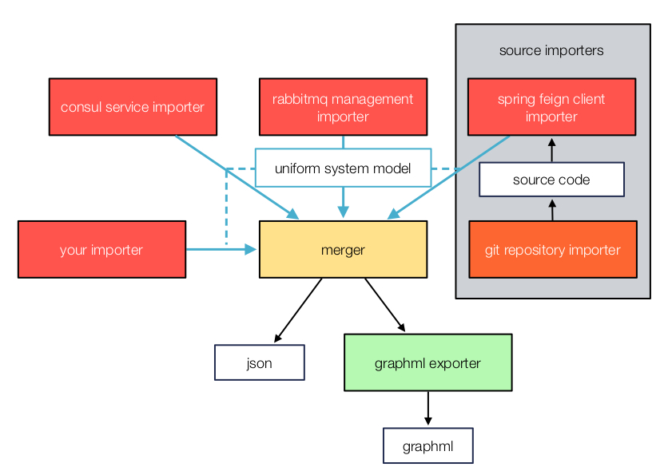

# microservice-system-analyzer

The microservice-system-analyzer allows to analyze the communication in a system of microservices in order to visualize the topology of the system. In our approach, static information about communication links is collected by different importers and mergers which are provided as a library. This is different from APM solutions, such as AppDynamics, that can analyze dynamic communication in a running system.

The analyzer collects information by

  1. accessing infrastructure services via standard REST APIs (e.g. Consul and RabbitMQ) and by
  2. parsing the source code of microservices.

[Example Topology](./example-graph.png) created using the layouting tool [yEd](https://www.yworks.com/yed) on the GraphML which was exported by analyzing a large microservice system (see GraphML exporter below).

## Data processing

The analyzer aggregates data from a set of importers into a unified system model. Exporters operate on this model and create concrete analysis results.



### Importers

- Spring FeignClients: An importer that searches for `@FeignClient` annotations in source code to capture synchronous communication links.
- RabbitMQ-Management: An importer for asynchronous communication links that accesses the RabbitMQ Management API. It requires to follow a schema for naming queues and exchanges.
  - A sending microservice has to send data to an exchange with the same name as the microservice. E.g. microservice A sends data to exchange A.
  - A receiving microservice creates a queue and binds it to an exchange. The name of the queue has to begin with name of the receiving microservice followed by a dot and any more characters. E.g. microservice B creates a queue B.foo and binds it to the exchange A.
- Consul
- Git-Repositories

### Exporters

- JSON
- GraphML
- Obfuscator for demos

## Requirements

- Node.js 8
- Git

## Getting started

### Tests

Tests can be run via `npm run test`.

### Configuration

The library must be configured by the following environment variables:

  - CONSUL_PATH: URL to Consul HTTP API
  - RABBITMQ_PATH: URL to RabbitMQ Management HTTP API
  - GIT_REPOSITORY_PREFIX: Prefix for Git Repositories, e.g. `git@gitlab.yourOrganisation.de:group/`
  - IGNORED_SERVICES: comma separated list of services to ignore in analysis
  - SOURCE_FOLDER: location of source files in local file system which are imported with the Git importer

### Example usage of importers and merger

The library offers importers, exporters and a merger that have to be combined. The following code shows an example usage for merging the resulting systems of several importers.

```javascript
let analyzer = require('microservice-system-analyzer')

let consulImporter = analyzer.importer.consulImporter
let feignImporter = analyzer.importer.feignClientImporter
let rabbitmqImporter = analyzer.importer.rabbitmqManagementImporter

let systemMerger = analyzer.processor.systemMerger
let subSystemTransformer = analyzer.processor.subSystemTransformer

async function getSystem () {
  let consulSystem = await consulImporter.getSystem()
  let rabbitmqSystem = await rabbitmqImporter.getSystem()
  let feignSystem = await feignImporter.getSystemWithLinksInReverse()
  let mergedSystem = systemMerger.mergeSystems([consulSystem, rabbitmqSystem, feignSystem])

  return mergedSystem
}

async function getSystemWithSubSystems () {
  let flatSystem = await getSystem()
  let structuredSystem = subSystemTransformer.transform(flatSystem)

  return structuredSystem
}
```

### Example usage of Git importer

Some importers require source code that is usually available via Git repositories. The following example shows how to use the Git importer to get the source code.

```javascript
let analyzer = require('microservice-system-analyzer')

let gitImporter = analyzer.importer.gitRepositoryImporter
let configRepository = analyzer.configRepository

let sourcePath = gitImporter.importRepository(serviceName, getRepositoryName(serviceName))
// import is successfull if sourcePath is not null

function getRepositoryName (serviceName) {
  return configRepository.getGitRepositoryPrefix() + serviceName
}
```

### Example usage of GraphML exporter

The code below shows how to use the GraphML exporter on a system returned by a merger or an importer.

```javascript
let analyzer = require('microservice-system-analyzer')

let graphMLExporter = analyzer.exporter.graphMLExporter

let xml = graphMLExporter.getGraphML(system)
```

## License

[Apache License, Version 2.0](LICENSE)

Copyright 2017-2018 Andreas Blunk, MaibornWolff GmbH