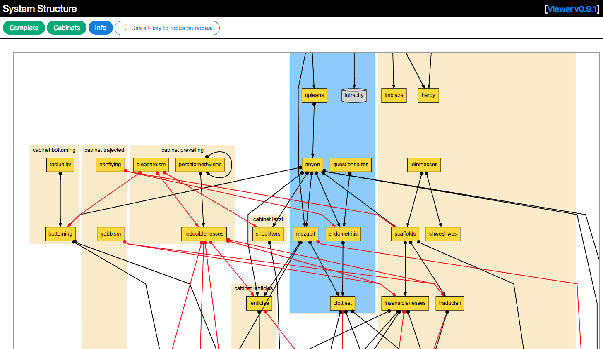

# tadis-ui

tadis-ui is a Docker-based microservice that transforms a [system model](./src/domain/model.ts) into HTML + SVG and provides it via a HTTP server. The viewer uses [graphviz-d3](https://github.com/magjac/d3-graphviz) which is ultimately based on [Graphviz](http://www.graphviz.org/). It transforms a system model to DOT first and then from DOT to SVG.

## Example

### Picture of zoomed in example system

### Video of the viewer in action

It shows the focussing on single nodes by displaying theirs neighours only. And then neighbours and neighbours of neighbours and so on.

## Usage

### Quick start

If you just want to try the viewer and play with it, do the following:

- `yarn start` builds the bundle that is used in [index.html](./src/html/index.html) and runs a web server that provides the index.html and some more endpoints
- access the [local example system](./src/exampleSystems/simpleSystem.ts): `http://localhost:8080/tadis/html/?demo=1`

### Configuration

The viewer needs to fetch the system that is to be visualized from a URL. There are two options which are configured by environment variables. You may set the variables by placing them into a `.env` file in the viewers root directory.

a) Direct URL

- SYSTEM_PROVIDER_URL='http://localhost:8081/collect/system?version=1'

b) Indirect discovery through [Consul service discovery](http://consul.io/)

- CONSUL_BASE_URL='https://consulhost:8080'
- SYSTEM_PROVIDER_SERVICE_NAME='analyzer'
- SYSTEM_PROVIDER_SERVICE_ENDPOINT='/subsystems/json'

Further configuration:

- NODE_ENV='production' enables production mode
- CACHE_TTL_SECONDS=300 sets the time to live of the cache
- PORT sets the port of the HTTP server, default is 8080 if PORT is not specified

### Running the HTTP server

- local execution:
  - `yarn start`
- execution via docker container:
  - `yarn docker-build`
  - `yarn docker-run`
    (expects `.env` file with environment variables in current directory)

### Accessing output

- http://localhost:8080/tadis/html/

### Options

In addition, the following options can be specified via query parameters:

- `demo=1` loads an example system as input
- `debug=1` shows debug information in the graph from metadata
- `last=1` forces the viewer to use last system successfully fetched (as fallback)
- `anonymize=1` anonymizes all node names
